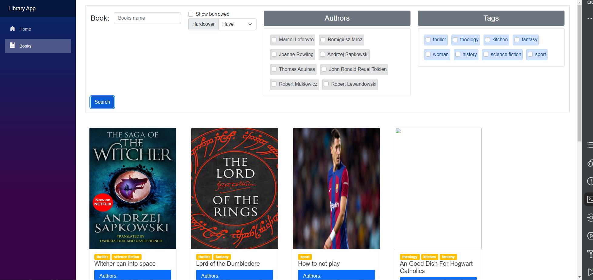

# Kurs

Testowanie i Jakość Oprogramowania / Projekt

# Autor

Filip Broniek

# Temat projektu

Aplikacja do wyporzyczania książek

# Opis projektu



**Biblioteka** to miejsce, gdzie przechowuje się i udostępnia różnego rodzaju zasoby informacyjne, takie jak książki, czasopisma, materiały multimedialne, dokumenty historyczne, a także oprogramowanie lub narzędzia edukacyjne. Biblioteki pełnią istotną rolę w zbieraniu, organizowaniu, przechowywaniu i udostępnianiu wiedzy oraz kultury.

**Mechanizm filtrowania** jest szególnie potrzebny w elektronicznej wersji biblioteki, gdzie nie ma bilbiotekarza, który mógłby pomóc nam w znalezieniu interesującej nas książki.

Każda **książka** ma swoich **autorów** i **tagi** określające kategorię książki.

# Uruchomienie projektu

Pobierz i zainstaluj [.Net7.0](https://dotnet.microsoft.com/en-us/download) jeżeli nie masz go na swoim komputerze

## API
1. Przejdź do folderu `src/LibraryApp.Api`
2. Jeżeli uruchamiasz pierwszy raz wykonaj następującą komendę

```
dotnet ef database update
```

3. Uruchom api poleceniem:

```
dotnet run
```

## Web
1. Przejdź do folderu `src/LibraryApp.Web`
2. Uruchom apikację webową poleceniem:

```
dotnet run
```

# Dokumentacja API

1) `/books`
    - Parametry: `TagIds`, `AuthorIds`, `KeyWord`, `HardcoverRequirement`, `ShowBorrowed`
    - Typ: `GET`
    - Zwraca: Książki w formacie JSON przefiltrowane za pomocą parametrów
2) `/authors`
   - Typ: `GET`
   - Zwraca: Wszyscy autorzy w formacie JSON
3) `/tags`
   - Typ: `GET`
   - Zwraca: Wszystkie tagi w formacie JSON

# Technologie użyte w projekcie

- C# 11.0
- .NET 7.0
- Blazor
- Markdown
- HTML
- CSS
- Entity Framework
- ASP .NET Core